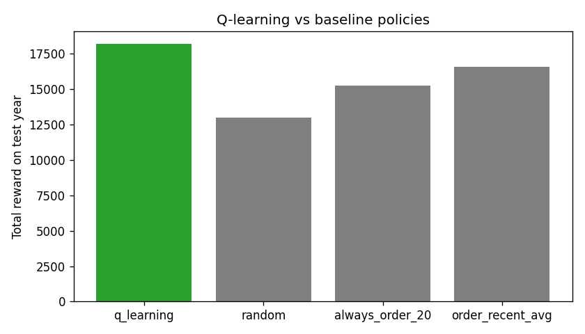
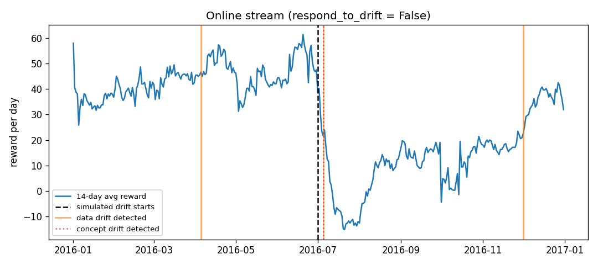

# Inventory Restocking Agent — DS-4491 MLSD Project

A tabular Q-learning agent that decides how much stock to reorder each day,
built as a reproducible DVC pipeline. Bonus: River online learning, ADWIN drift
detection with an automatic retraining response, and an optional Feast feature store.

## Problem and Dataset
A shop must decide every day how many units to order. Ordering costs money today,
leftover stock costs holding fees, and running out loses sales.

- **Dataset:** Kaggle *Store Item Demand Forecasting Challenge*, store 1 / item 1 —
  1,826 daily rows (2013–2017). No Kaggle account? `tools/get_data.py` generates a synthetic series.
- **Split (chronological, never shuffled):** train 2013–2015, stream 2016 (online stage),
  test 2017 (evaluation).
- **Simulated drift:** from 2016-07-01, stream demand is multiplied by `drift_factor` (2.0).
  The test year is left untouched.

## ML Model
Tabular **Q-learning** with ε-greedy exploration.
- **State (168):** stock bucket (8) × day of week (7) × demand trend (3)
- **Actions (4):** order 0, 10, 20 or 40 units (delivered overnight)
- **Reward:** `5·sold − 2·ordered − 0.3·leftover − 2·unmet`
- **Update:** `Q(s,a) ← Q(s,a) + α[r + γ·max Q(s',a') − Q(s,a)]`, α=0.1, γ=0.95, 600 episodes

## Project Structure
```
├── data/raw/sales.csv(.dvc)   raw data (DVC-tracked)
├── data/processed/            prepare outputs (DVC-tracked)
├── src/                       prepare, env, agent, train, evaluate, online_drift, feast_serve, utils
├── feature_repo/              Feast definitions (optional)
├── tools/get_data.py          creates data/raw/sales.csv
├── tests/smoke_test.py        sanity checks
├── models/q_table.json        trained policy (DVC-tracked)
├── metrics/                   train/eval/drift JSON + plot CSVs
├── results/                   figures
├── params.yaml  dvc.yaml  dvc.lock  requirements.txt  .gitattributes
```

## DVC Pipeline
```
sales.csv.dvc → prepare → train → evaluate
                   └──────────┴──→ online_drift
```
| Stage | Input | Output |
|---|---|---|
| prepare | sales.csv, `prepare` params | train/stream/test parquet |
| train | train.parquet, `env`,`train` params | q_table.json, training curve |
| evaluate | q_table, test.parquet | eval.json, policy_comparison.png |
| online_drift | q_table, stream.parquet, `online`,`drift` params | drift.json, online_drift.png |

## How to Run


Requires **Python 3.11**. The commands below use Windows PowerShell.

### 1. Clone and create the environment

```powershell
git clone https://github.com/Az-main/Q-learning-MLSD-Project.git
cd Q-learning-MLSD-Project
py -3.11 -m venv .venv
.\.venv\Scripts\Activate.ps1
python -m pip install -r requirements.txt
```

### 2. Configure DagsHub credentials

The project uses a shared DagsHub DVC remote. For a private repository, every
collaborator must configure their own DagsHub username and access token:

```powershell
dvc remote modify origin --local auth basic
dvc remote modify origin --local user YOUR_DAGSHUB_USERNAME
dvc remote modify origin --local password YOUR_DAGSHUB_TOKEN
```

Replace `YOUR_DAGSHUB_USERNAME` and `YOUR_DAGSHUB_TOKEN` with your own values.

Credentials are stored in `.dvc/config.local`, which is ignored by Git. Never
commit this file or share your access token.

### 3. Download the DVC-tracked files

```powershell
dvc pull
```

This downloads the raw data, processed datasets, trained model, and other
DVC-tracked pipeline outputs from DagsHub.

### 4. Verify and run the project

```powershell
dvc status
dvc repro
dvc dag
dvc metrics show
dvc plots show
python tests/smoke_test.py
```

`dvc status` should report that the data and pipelines are up to date. The
original `D:\dvcstore` remote is retained only as a local backup on the original
development PC; DagsHub is the default shared remote.

## Collaboration Workflow

Before starting work, synchronize the Git files and DVC-tracked artifacts:

```powershell
git pull
dvc pull
```

After changing code, parameters, data, or pipeline outputs:

```powershell
dvc repro
dvc push
git status
git add .
git commit -m "Describe the change"
git push
```

Each contributor should use their own Git branch when working simultaneously.
This reduces conflicts and allows changes to be reviewed before merging.
## Results

| Policy (2017 test year) | Total reward | Service level | Stockout days | Avg leftover |
|---|---|---|---|---|
| **Q-learning** | **18,197** | 0.86 | 0.47 | 3.9 |
| Order recent average | 16,589 | 0.89 | 0.34 | 26.5 |
| Always order 20 | 15,258 | 0.87 | 0.38 | 27.8 |
| Random | 12,980 | 0.81 | 0.27 | 27.3 |

- The agent keeps the shelf lean (3.9 units left per night vs ~27), accepting small
  shortfalls because holding stock costs money.
- With γ = 0 the agent never orders: total reward −16,054, service level 0.2%.
- Drift: concept drift was detected 4 days after the demand jump. Average daily reward
  after drift was 51.5 with the retrain response and 13.7 without it.


### Drift Response Comparison

The conditions before the simulated drift are nearly identical. After the
demand increase, automatic retraining substantially improves performance.

| Metric | Response enabled | Response disabled |
|---|---:|---:|
| Average daily reward before drift | 44.07 | 43.84 |
| Average daily reward after drift | 51.51 | 13.66 |
| Online total reward | 17,498.2 | 10,493.5 |
| Retraining events | 3 | 0 |

The final project configuration uses `drift.respond: true`.

#### Response Enabled


#### Response Disabled

